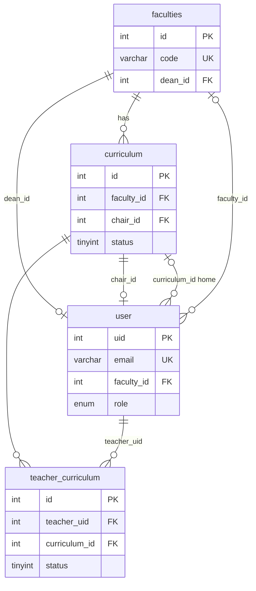
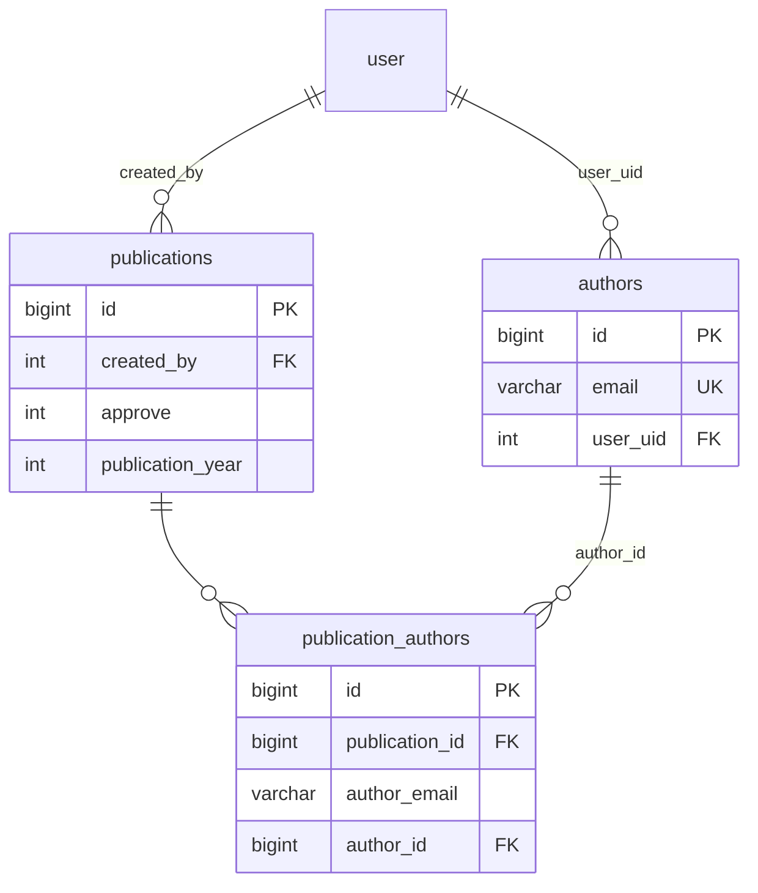
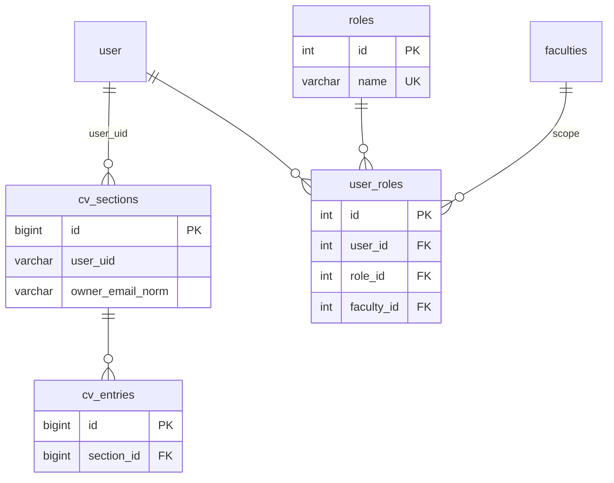

# Database schema — `rac` (Research Record)

อัปเดตหลัง migration `20260530170000_SchemaClarityImprovements`

## Overview

| Metric | Value |
|--------|-------|
| Database | `rac` |
| Engine | InnoDB, utf8mb4 (ส่วนใหญ่) |
| Base tables | 15 |
| Views | `teacher_curriculum_view`, `publication_view` |
| Hub tables | `user`, `curriculum`, `publications` |

## Domain map

| Domain | Tables | ความสัมพันธ์หลัก |
|--------|--------|------------------|
| **Organization** | `faculties`, `curriculum`, `user`, `teacher_curriculum` | คณะ → หลักสูตร → อาจารย์ (M:N) |
| **Publications** | `publications`, `publication_authors`, `authors` | ผลงาน → ผู้แต่ง → (email → `user` / `authors`) |
| **CV** | `cv_sections`, `cv_entries` | เจ้าของ = `owner_email_norm` (แนะนำ) หรือ `user_uid` |
| **RBAC** | `roles`, `user_roles` | Canonical บทบาท; `user.role` ยังใช้ในแอป (legacy) |
| **Admission** | `student_admission_forms`, `admission_form_teachers` | ฟอร์มรับนักศึกษา (แยกจาก `teacher_curriculum`) |
| **Profile** | `user_profile` | ORCID cache / โปรไฟล์เสริม |

## ER — Organization



## ER — Publications



## ER — CV & RBAC



## Foreign keys (หลังปรับปรุง)

| Table | Column | → | On delete |
|-------|--------|---|-----------|
| `publications` | `created_by` | `user.uid` | RESTRICT |
| `user` | `faculty_id` | `faculties.id` | SET NULL |
| `user` | `curriculum_id` | `curriculum.id` | SET NULL |
| `teacher_curriculum` | `teacher_uid`, `curriculum_id` | `user`, `curriculum` | (เดิม) |
| `publication_authors` | `publication_id`, `author_id` | `publications`, `authors` | (เดิม) |
| `cv_entries` | `section_id` | `cv_sections.id` | (เดิม) |

## Indexes เพิ่ม (performance / clarity)

| Index | Table | Columns |
|-------|-------|---------|
| `idx_publications_approve` | publications | approve |
| `idx_publications_created_by` | publications | created_by |
| `idx_publications_year` | publications | publication_year |
| `idx_tc_curriculum_status` | teacher_curriculum | curriculum_id, status |
| `idx_cv_sections_owner_email` | cv_sections | owner_email_norm |

## Identity rules (แนะนำในโค้ด)

| Entity | Canonical key | หมายเหตุ |
|--------|---------------|----------|
| User | `user.uid` + `user.email` (unique) | API ผลงานจับคู่ผ่าน email normalized |
| Publication author | `publication_authors.author_email` → `authors` / `user` | |
| CV owner | `cv_sections.owner_email_norm` | migrate จาก `user_uid` |
| Role | `user_roles` (+ legacy `user.role`) | ใช้ `RoleHelper` ให้สอดคล้อง |

## ข้อจำกัดที่ยังไม่เปลี่ยน (โดยเจตนา)

- **`user.uid` int(3) ZEROFILL** — เปลี่ยน type กระทบทั้งระบบ; วางแผน migration แยก
- **คอลัมน์โปรไฟล์ซ้ำ** (`user` vs `user_profile`) — deprecate ทีละฟิลด์ในแอป
- **`student_admission_forms` กว้าง** — แยก normalize เป็น phase ถัดไป
- **`publication_view`** — read model; อย่าแก้ schema ผ่าน view

## ตรวจสอบความสมบูรณ์

```bash
docker exec -i shared_mysql mysql -uroot -prootpass rac < scripts/verify-schema-integrity.sql
```

หลัง migration `20260530170000`: แถว `teacher_curriculum` ที่อ้าง user/หลักสูตรที่ไม่มีแล้วจะถูก **deactivate** (`status=0`) ไม่ลบทิ้ง

## นำ migration ขึ้น production

```bash
# หลัง backup DB
docker exec shared_php php /var/www/html/ResearchRecord/scripts/run-schema-clarity-migration.php
# หรือบน server ที่มี spark + .env ชี้ production DB
```

## Migrations ที่เกี่ยวข้อง

- `20260530170000_SchemaClarityImprovements` — FK, index, comments, seed roles
- `20260524180000_AddOwnerEmailToCvSections` — email identity สำหรับ CV
- `2025-11-06-074338_CreateRolesTables` — สร้าง roles / user_roles
