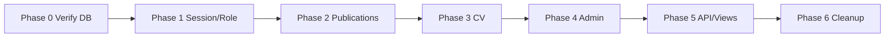

# แผนแก้ Local — Email เป็น Primary Key (ยกเลิก uid)

เป้าหมาย: ให้ **local Docker (`rac`) + โค้ด** ทำงานครบโดยใช้ **email** เท่านั้น ก่อน deploy production

**สถานะ DB local:** migration `20260530180000` รันแล้ว (`user.email` = PK, ไม่มี `uid`)  
**สถานะโค้ด:** local ครบตามแผน — identity, publications, admin APIs, CV/ORCID, curriculum reports ใช้ email แล้ว; E2E 29/29

---

## หลักการ (ใช้ทุก phase)

| กฎ | รายละเอียด |
|----|------------|
| Identity | `UserIdentity::normalizeEmail()` + `current_user_email()` |
| Session | `user_email` และ `user_id` = **email** (ไม่ใช่ตัวเลข) |
| ห้ามอ้าง | `user.uid`, `teacher_uid`, `pa.uid`, `authors.user_uid`, `created_by` (int) |
| แทนที่ด้วย | `user.email`, `teacher_email`, `created_by_email`, `owner_email_norm` |
| Model PK | `UserModel::$primaryKey = 'email'` → `find($email)` |

---

## Phase 0 — ยืนยันฐาน (ครั้งเดียว)

| ขั้น | การกระทำ | ผ่านเมื่อ |
|------|----------|----------|
| 0.1 | `docker ps` → `shared_mysql`, `shared_php` ทำงาน | containers up |
| 0.2 | `SHOW COLUMNS FROM user` → ไม่มี `uid`, `email` = PRI | schema OK |
| 0.3 | `mysql < scripts/verify-schema-integrity.sql` | orphan active = 0 |
| 0.4 | `php scripts/test-curriculum-detail-api.php` | 13/13 |
| 0.5 | Backup local: `mysqldump rac > deploy-backups/db/rac_after_email_pk.sql` | มีจุด rollback |

---

## Phase 1 — Core identity (P0, ~1 วัน)

แก้ทุกที่ที่ **login / session / role** อ่าน user

| ลำดับ | ไฟล์ | งาน |
|-------|------|-----|
| 1 | `app/Helpers/RoleHelper.php` | ใช้ `current_user_email()` แทน uid |
| 2 | `app/Filters/*AuthFilter.php` | `find(session email)` ไม่ใช่ int `user_id` |
| 3 | `app/Controllers/AuthenController.php` | ลบ log/field `uid` ที่เหลือ; author ใช้ `user_email` |
| 4 | `app/Models/AuthorModel.php` | `getAuthorlinkUser`, `linkAuthorToUser` → email joins |
| 5 | `app/Models/UserRoleModel.php` | `user_email` แทน `user_id` |

**→ verify:** login OAuth + backdoor → dashboard โหลด, session มี `user_email`

```bash
# หลัง login ใน tinker/container
php -r "... session user_email ..."
```

---

## Phase 2 — Publications (P0, ~1–2 วัน)

| ลำดับ | ไฟล์ | งาน |
|-------|------|-----|
| 1 | `PublicationModel.php` | เหลือ `getPublicationsByFaculties`, `created_by` ใน view queries |
| 2 | `PublicationController.php` | สร้าง/แก้ผลงาน → `created_by_email` |
| 3 | `PublicationAuthorModel.php` | ลบ logic `pa.uid` |
| 4 | `app/Views/publications/*` | JS/form ส่ง email แทน uid |

**→ verify:**

- User A login → My Publications จำนวนเท่าเดิม
- Co-author ที่มีแค่ `author_email` ยังเห็นผลงาน
- สร้างผลงานใหม่ → `created_by_email` = session email

```bash
php scripts/test-curriculum-detail-api.php   # regression
# manual: เปรียบ COUNT ก่อน/หลัง สำหรับ email ทดสอบ 1 คน
```

---

## Phase 3 — CV + Sync (P0, ~1 วัน)

| ลำดับ | ไฟล์ | งาน |
|-------|------|-----|
| 1 | `CvSectionModel.php` | read/write `owner_email_norm` only |
| 2 | `DashboardController.php` | CV routes — แทน `user_uid` (~145 จุด) |
| 3 | `CvSyncApiController.php` | bundle by email; dual-write ตัด `user_uid` |

อ้างอิง: `docs/EMAIL_IDENTITY_MIGRATION_PLAN.md` Phase 3

**→ verify:**

- `dashboard/cv` แสดง section เดิม
- CRUD section/entry
- `GET/POST cv-bundle-by-email` (ถ้ามี HMAC local)

```bash
mysql < scripts/verify-email-identity-migration.sql   # CV_ORPHANS, PUBLICATION_PARITY
```

---

## Phase 4 — Admin & หลักสูตร (P1, ~2 วัน)

| กลุ่ม | ไฟล์หลัก |
|-------|----------|
| Admin | `AdminController.php`, `AdminDashboardController.php` |
| หลักสูตร | `FacultyCurriculumController.php`, `UserModel` (teacher_curriculum CRUD) |
| คณะ | `FacultyModel.php` → `dean_email` |
| หลักสูตร model | `CurriculumModel.php` → `chair_email` (ลบ `chair_id`) |
| User admin | `UserController.php`, views `manageUser`, `admission` |

**→ verify:** จัดการ user/หลักสูตร/assign อาจารย์ได้; dean/chair บันทึกเป็น email

---

## Phase 5 — API อื่น + Views (P1, ~1 วัน)

| ไฟล์ | งาน |
|------|-----|
| `ApiController.php` | endpoints ที่ยังส่ง `uid` (ยกเว้นที่ตัดแล้ว) |
| `EducationController.php` | `user_uid` ใน education admin |
| `StudentAdmissionFormModel.php` | `user_id` → `user_email` |
| `faculty_search/*`, `secret/backdoor` | API key + email |
| `RrOpenApiSpec.php` | schema ไม่มี uid |

---

## Phase 6 — ทำความสะอาด (P2)

| งาน | รายละเอียด |
|-----|------------|
| ลบ dead code | `resolveUidFromEmail` ถ้ามีที่ไหนเพิ่มกลับมา |
| Scripts SQL เก่า | ระบุ deprecated หรืออัปเดต comment |
| Migrations เก่า | **ไม่แก้** (ประวัติ) — มีแค่ `20260530180000` สำหรับ DB จริง |
| Docs | รวม `DATABASE_SCHEMA.md`, `EMAIL_IDENTITY_MIGRATION_PLAN.md` |

```bash
rg '\buid\b|teacher_uid|user_uid' app --glob '*.php' | wc -l
# เป้า: 0 ใน app/ (ยกเว้น migrations เก่า + comments)
```

---

## ลำดับแนะนำ (สรุป)



**อย่า deploy production ก่อน Phase 0–3 ผ่านครบ**

---

## Checklist รวมก่อนปิดงาน local

- [ ] Login / logout / role (user, faculty_admin, super_admin)
- [ ] My Publications + approve filter
- [ ] CV ครบ CRUD
- [ ] Curriculum API + `/docs` token
- [ ] Admin: assign teacher ↔ curriculum (`teacher_email`)
- [ ] `rg uid` ใน `app/` เหลือเฉพาะ migrations เก่า
- [ ] `php vendor/bin/phpunit` (ถ้ามี test ที่เกี่ยวข้อง)
- [ ] Commit แยก phase (review ง่าย)

---

## Git strategy (แนะนำ)

| Commit | เนื้อหา |
|--------|---------|
| 1 | DB migration + scripts + docs (มีแล้วบางส่วน) |
| 2 | Phase 1 core identity |
| 3 | Phase 2 publications |
| 4 | Phase 3 CV |
| 5 | Phase 4–6 |

Branch: `feature/rr-email-primary-key` (หรือต่อจาก `feature/rr-email-identity`)

---

## ความเสี่ยง local

| ความเสี่ยง | แก้ |
|-----------|-----|
| Session เก่าใน browser ยังเก็บ uid ตัวเลข | logout แล้ว login ใหม่ |
| View cache | hard refresh |
| `publication_view` ใช้ `created_by_email` | ตรวจ Admin ที่ filter `created_by` |
| แก้ทีละไฟล์ใหญ่ (Dashboard) | แยก PR/commit ตาม phase |

---

## หลัง local เสร็จ (ยังไม่ทำในแผนนี้)

1. Pull DB production ล่าสุด (ถ้าต้องการ)
2. รัน migration บน staging/production + backup
3. Deploy PHP ตาม phase เดียวกัน
4. Smoke test production

ดู `docs/EMAIL_PRIMARY_KEY_MIGRATION.md` สำหรับขั้นตอน server
